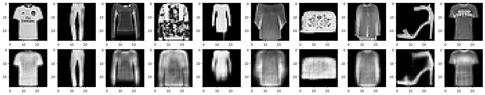
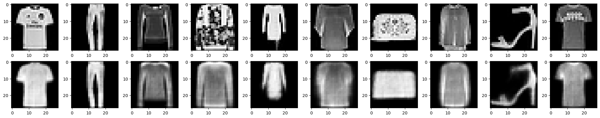
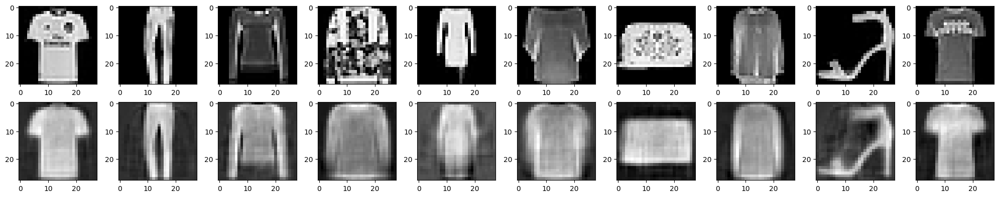
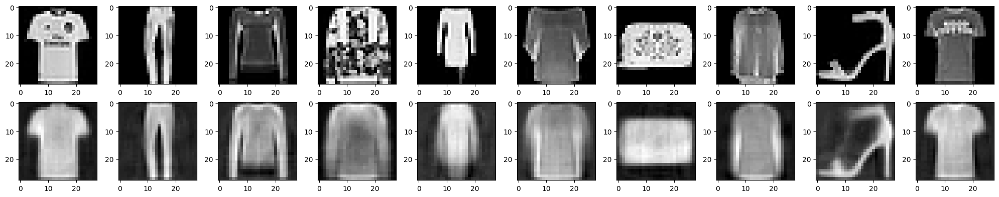

# My observations from tinkering with autoencoders

Autoencoders were very new to me and took some time to wrap my head around it. I was wondering Why we had to compress and decompress, like what even is the point? After watching a bunch of videos and reading some websites, I truly learnt about it's power in anomaly detection, noise detection and so much more. I'd like to thank my goated spider seniors for introducing me to such topics and giving me the pathway to learn the same.

## Bottleneck

I ran the code multiple times with differing bottlenecks, and the **output was better for larger bottlenecks**. Though I couldn't visibly see much distinction in the test dataset, the loss speaks for itself. I saw a considerable decrease in loss in both training and validation data with higher bottlenecks. My guess is that with more data, it's easier for the model to recreate the original image.

### Below, I've set the bottleneck to 32
In the notebook, bottleneck is 18

## Epochs

Though the loss becomes saturatedly small after sufficient epochs for any model, I still tinkered with the epochs and found **small improvement with more epochs**.

### This is with 20 epochs

## Activation

This part was a woah moment for me. I saw because of the way that sigmoid was structured (squishing inputs between 0/1), the images had better distinction between the black background and the actual clothes. **It resulted in brighter clothes and a darker background**.

### Attched image is without sigmoid

## Normalization

I thought that normalization was always done, no matter what model. I was very wrong. As it turns, since sigmoid automatically squishes between 0/1, applying normalization would result in negative and weird values. So it's either a linear output w/ normalization or **sigmoid w/o normalization**.

### Attached image is without sigmoir nor normalization

## Depth of Model

I tried increasing the number of layers, keeping the same bottleneck, but noticed only a very very slight if not no difference. I suppose the **effect of the bottleneck outweighs more neurons**.